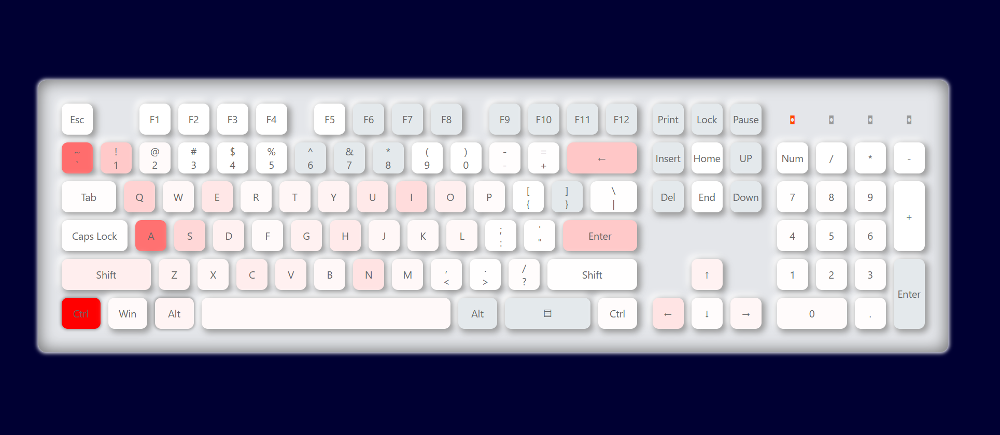

# TraceBoard——一个统计键盘使用情况的小工具

## 现有功能

* 可视化键盘按键使用情况



## 待开发功能

* 常用按键情况
* 时间统计分析

## 使用

Windows用户可以直接[点击下载](https://github.com/LC044/TraceBoard/releases)exe可执行文件，直接双击就能运行。其他系统用户可以自行编译(运行)源码。

### 安装依赖

```bash
pip install -r requirements.txt
```

### 运行main.py

```bash
python main.py
```

## 感谢

[键盘UI](https://yanyunfeng.com/article/41)